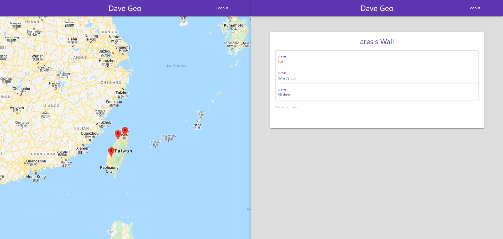
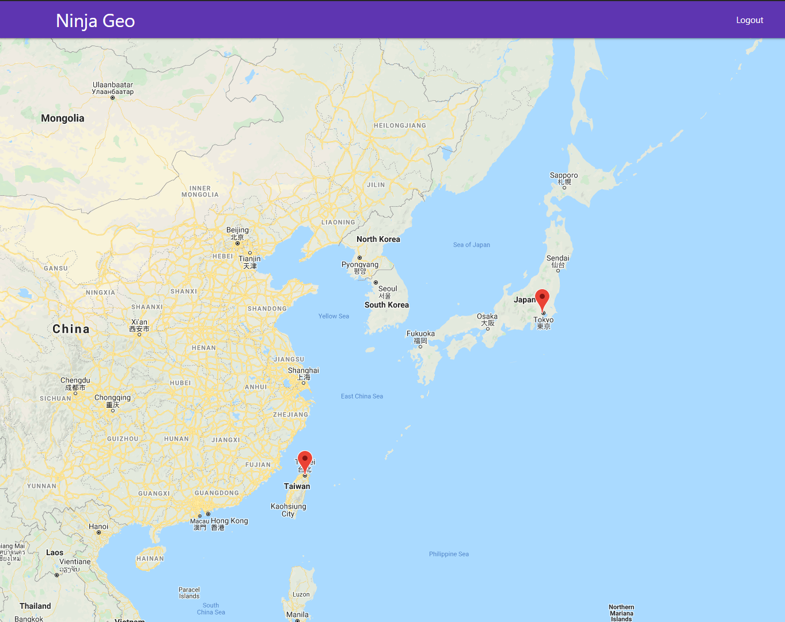

# ninja-geo

A Vue.js SPA with real-time comment function hosted on Google Firebase, using Google Map Api.

Demo link: https://ninja-geo-c0636.web.app/

## Screenshot

You can click on an user's map marker to comment on their board in realtime:

You can also see all the user's geo-location on the map:

